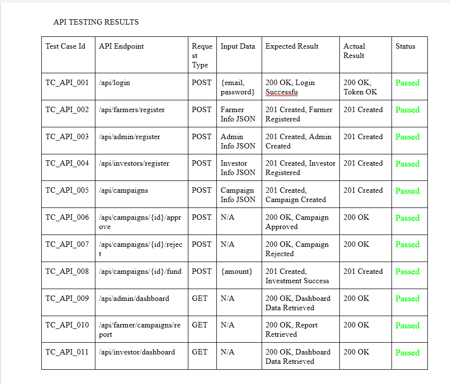

    # CROWDFARM Project

## Description

### CrowdFarm
is a web-based investment and campaign management platform designed to connect farmers with potential investors. The system allows farmers to create agricultural projects and campaigns, while investors can browse, fund, and track these initiatives. Admins manage user accounts, approve campaigns, and oversee system operations. Featuring secure authentication, role-based access, and a structured database, CrowdFarm ensures transparent, traceable investment flows and promotes agricultural development through community-driven funding.
##
## ELPHP Members:
* [Neil Cuenca](https://github.com/neilon55) 
* [Audisey Bardelas](https://github.com/Audissey123) 
* [Criselda Belandres](https://github.com/Cbelandres) 
* [Xandrew Sean Allen Bontuyan](https://github.com/SeanBontuyan) 

## PHP Repo [Link:](https://github.com/neilon55/ELPHP_MINDBLOTS_130SAT)
* (https://github.com/neilon55/ELPHP_MINDBLOTS_130SAT)
* https://github.com/Cbelandres/ELPHP_MINDBLOTS_1130-130SAT.git

## Document [Link:](https://docs.google.com/document/d/1aEkL-NIePin8jgEkHg7WW5k4NbAf2-7eyNC0W23IRVE/edit?tab=t.0) 
[

]

